# **2.3 社区模块**

## 2.3.1提交评论功能

提交评论功能是平台允许用户在平台上发表自己的意见、建议和评论的功能。用户可以使用该功能来表达对新闻、文章、产品或服务的看法，从而与其他用户进行交流和互动。下面描述操作流程。

 

**提交评论流程如下：**

1. 用户登录后，可点击【社区】，点击目标【主题】。

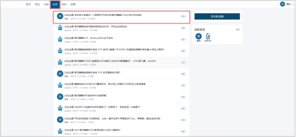 

2. 在评论框填写评论意见。

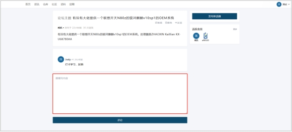 

3. 点击【提交】评论。

 

 

 

 

 

 

 

 

## **2.3.2提交结果反馈**

提交评论功能是平台允许用户在平台上发表自己的意见、建议和评论的功能。用户可以使用该功能来表达对新闻、文章、产品或服务的看法，从而与其他用户进行交流和互动。下面描述操作流程。

 

**提交评论结果反馈流程**

1. 用户填写评论，点击【提交】按钮。

 

2. 系统验证评论信息，验证通过完成提交，验证失败返回原因，提示用户重新填写。

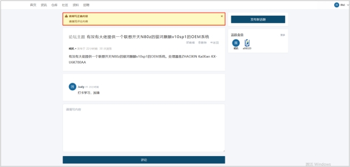 

### **2.3.3评论显示管理**

用户提交评论后，评论内容只有本账号才会显示，需要后台审核通过后，不同用户才可查看，下面描述操作流程。

 

**评论显示管理流程**

1. 用户提交评论后，等待后台审核通过。

 

2. 若通过审核，其他用户评论同一文章时，页面显示审核通过的评论内容，反之页面不显示评论内容。

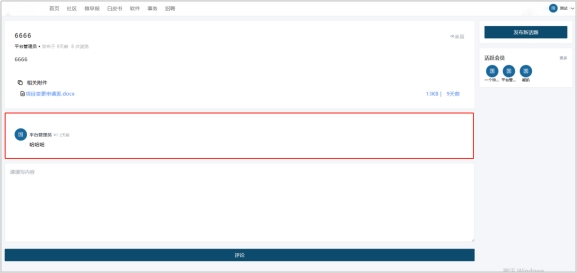 

 

## **2.3.4发布新话题**

发布新话题功能是平台允许用户在平台上创建新的讨论主题的功能。用户可以使用该功能来发起关于某个话题的讨论，从而与其他用户进行交流和互动。发出见解下面描述操作流程。

**发布新话题流程**

1. 用户进入社区界面，点击【发布新主题】。

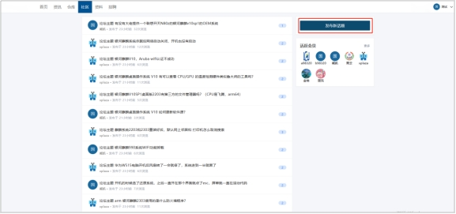 

2. 填写主题内容（可上传附件、插入图片）。

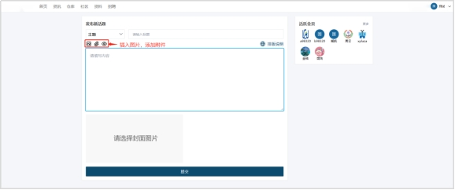 

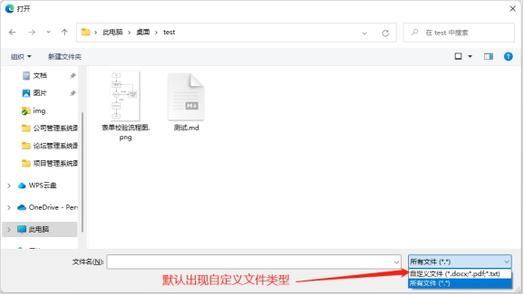 

3. 点击【提交】。

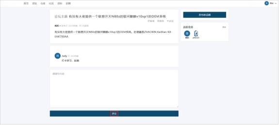 

 

 

 

 

 

 

 

## **2.3.5提交主题删除**

提交主题删除功能是平台允许用户在平台上删除自己发布的话题的功能。用户可以使用该功能来删除不再需要的话题或者错误的话题，从而保持话题列表的整洁和准确性。下面描述操作流程。

 

**提交主题删除流程图**

1. 用户进入社区，点击本用户发布的【主题】。

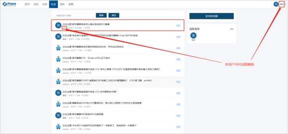 

2. 进入主题，点击【删除】。

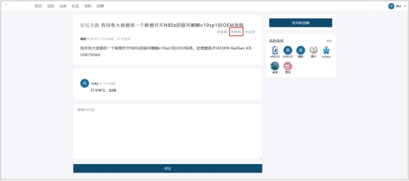 

 

 

 

 

## **2.3.6提交主题重新编译**

提交主题重新编译功能是平台允许用户在平台上重新编辑已发布的话题的功能。用户可以使用该功能来修改话题的标题、描述、标签等信息，从而更好地满足讨论的需求。下面描述操作流程。

 

**提交主题重新编译流程**

1. 用户进入社区，点击本用户发布的【主题】。

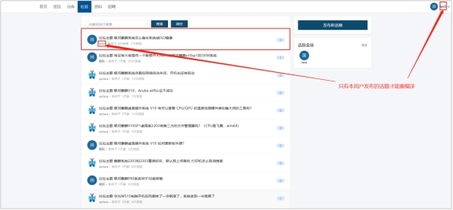 

2. 进入主题，点击【编译】

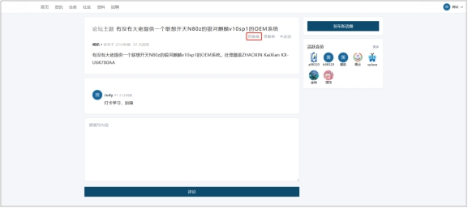 

3. 页面跳转到发布新话题界面，用户可重新编写

 

4. 编写完成后，点击【提交】

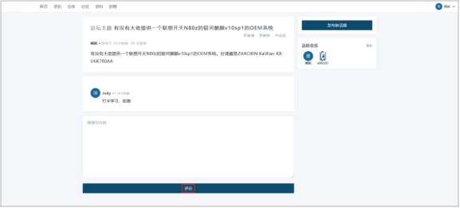 

 

 

 

 

 

 

 

 

## **2.3.7提交评论删除**

提交评论删除功能是平台允许用户在平台上删除自己发布的评论的功能。用户可以使用该功能来删除不再需要的评论或者错误的评论，从而保持评论区的整洁和准确性。下面描述操作流程。

**提交评论删除流程**

1. 用户进入社区，点击任意【主题】。

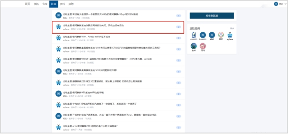 

2. 点击【删除】按钮，可删除自己的评论

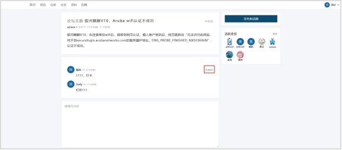 
