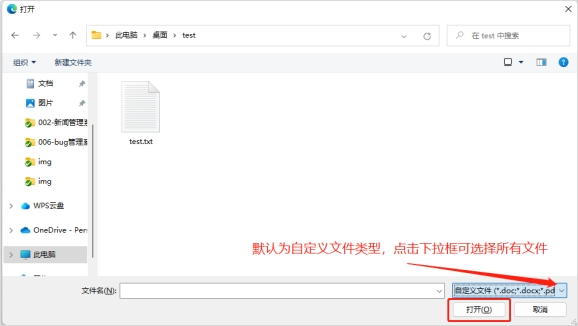
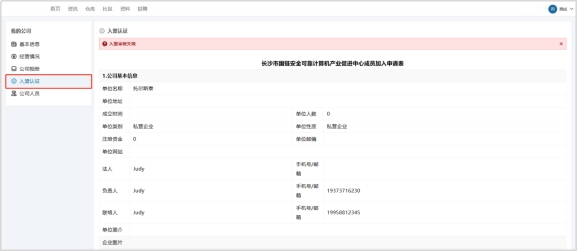
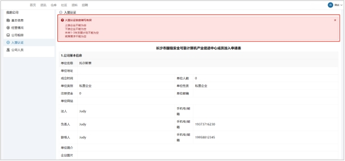

# **2.5 公司管理**

## **2.5.1 公司注册功能**

公司注册功能是一个允许用户在平台上进行公司注册的功能。用户可以使用该功能来在线完成公司注册流程，从而方便快捷地成立自己的公司。下面描述该功能操作流程。

 

**公司注册功能流程**

1. 用户【登录】后在页面点击企业管理或右上角个人图标下拉框的【我的公司】。

 

2. 点击【注册公司】，进入公司注册页面。

 

3. 填写注册表单信息，带*的表单项为必填项，点击【公司注册】。

 

4. 点击【日期图标】，选择开始与结束时间。

 

5. 点击【原件图标】，选择【上传】原件。

 

 

6. 等待后台审核反馈。

 

## **2.5.2 加入公司**

公司注册功能是一个允许用户在平台上进行公司注册的功能。用户可以使用该功能来在线完成公司注册流程，从而方便快捷地成立自己的公司。下面描述该功能操作流程。

 

**加入公司流程**

1. 用户【登录】，点击【我的公司】。

 

2. 点击【加入公司】。

 

3. 输入【公司名称】和【公司口令】。

 

4. 点击【加入】。

 

 

## **2.5.3 表单校验**

表单检验功能是一个用于检测和验证用户输入数据是否符合要求的功能。该功能可以帮助平台管理员或开发人员确保用户输入的数据格式正确、完整和安全，从而提高数据质量和系统安全性。下面描述该功能操作流程。

 

**表单校验流程**

1. 系统对【表单必选项】检测，看是否漏填或错填。

 

2. 用户修改，点击【提交】。

 

3. 页面跳转，提交成功。

 

 

 

## **2.5.4 经营情况**

经营情况功能是一个用于展示和分析公司经营情况的功能。该功能可以帮助公司管理人员或财务人员了解公司的财务状况、业务情况和发展趋势，并据此进行决策和规划。下面描述该功能操作流程。

 

**经营情况流程**

1. 用户进入经营情况模块，点击【经营情况】，进入经营情况界面。

 

2. 选择目标年份，点击【编辑】。

 

3. 填写表单项信息，带*为表单必填项。

 

4. 点击【上传】，上传附件。

 

 

5. 点击【更新】，页面更新，提示更新成功。

 

## **2.5.5 公司相册**

公司相册功能是一个用于在平台上创建和管理公司相册的功能。该功能可以帮助公司员工方便地共享和管理公司的照片和视频，例如公司活动照片、员工合影等。下面描述该功能操作流程。

 

**公司相册流程**

1. 用户进入公司相册模块，点击【公司相册】，进入公司相册界面。

 

2. 点击【+】，上传图片。

 

## 2.5.6 入盟申请

入盟申请功能是一个允许公司在平台上申请加入某个联盟的功能。公司可以使用该功能来方便快捷地申请加入自己感兴趣的联盟，从而获取更多的资源和支持。下面描述该功能操作流程。

 

**入盟申请流程**

1. 用户进入入盟认证模块，点击【入盟认证】，进入入盟表单界面。

 

2. 填写必填表单项，上传所需的文件。

 

 

3. 点击【申请入盟】。

 

4. 系统进行表单校验，若有表单项错填或漏填，返回处理信息。

 

 

## **2.5.7 公司人员管理**

公司人员管理功能是一个用于管理公司员工信息的功能。该功能可以帮助公司管理人员对员工信息进行统一管理，页面以表格的形式展示公司人员的编号、用户名、昵称、真实姓名、手机号码、邮箱、性别、角色、状态，下面描述该功能操作流程。

 

**页面简单展示**

 

 

## **2.5.8 公司人员搜索**

公司人员搜索是一个用于在公司内部查找员工信息的功能。该功能可以帮助员工快速找到需要联系的同事，也可以帮助管理人员进行人员调配和管理。下面描述该功能操作流程。

 

**公司人员搜索流程**

1. 点击【公司人员】，进入人员管理界面。

 

2. 在搜索输入框填写用户信息，点击【搜索】。

 

3. 若用户存在，页面出现人员信息。若用户不存在，页面显示空白。

 