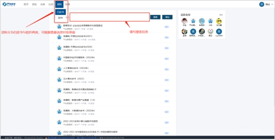
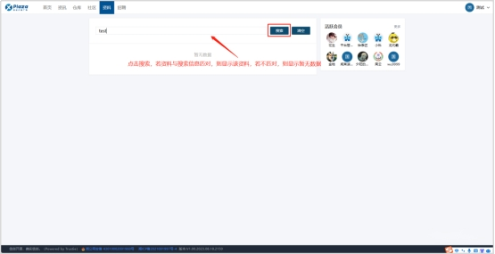
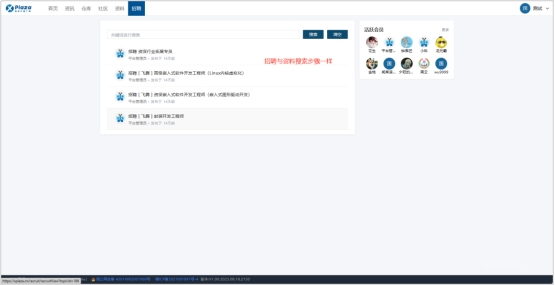
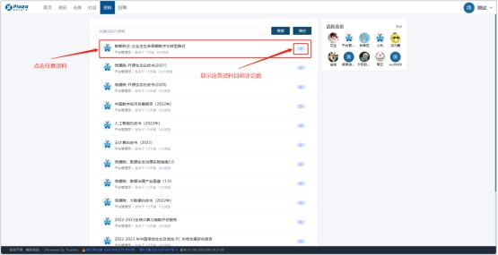
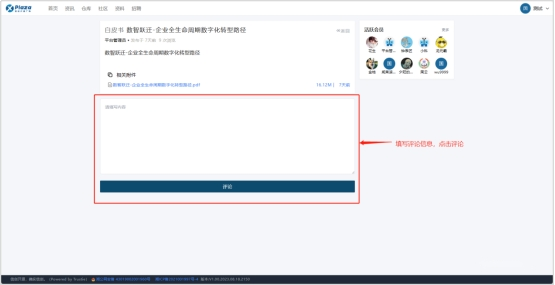
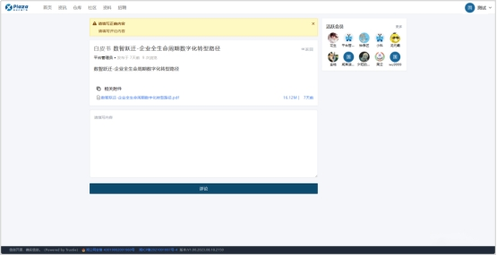

# **2.8 资料与招聘**

## 2.8.1资料与招聘搜索功能

资料与招聘搜索功能是指在代码托管平台上提供的用于搜索相关资料和招聘信息的功能。通过这个功能，用户可以方便地搜索与其开发项目相关的文档、教程、示例代码等资料，以及浏览与开发相关的工作机会和招聘信息。下面将以图文的形式描述该功能操作流程。

 

**资料与招聘搜索功能流程**

1. 进入资料或招聘界面，填写搜索框信息，点击【搜索】。

 

2. 若存在与搜索信息匹对资料或招聘信息，则页面显示该资料或招聘信息。若不存在与搜索信息匹对资料或招聘信息，则页面显示暂无数据。

 

 

 

## **2.8.2 资料评论功能**

资料与招聘评论功能是指在代码托管平台上提供的用于向其他用户提供反馈和评论的功能。通过这个功能，用户可以在资料和招聘信息页面上发表评论、提出问题、分享经验等，与其他用户进行交流和互动。下面将以图文的形式描述该功能操作流程。

 

**资料评论功能流程**

1. 进入任意资料信息内，填写评论信息，点击【提交】。

 

 

2. 系统对评论进行初步检测，若通过评论提交成功，等待后台审核，若失败，页面显示失败原因。

 