# **2.1 登录注册模块**

## **2.1.1** 用户登录功能

用户登录功能是一个允许用户通过提供凭据来访问平台的功能。通过用户登录，用户可以创建个人账户并使用其用户名和密码等凭据进行身份验证。下面介绍该功能具体流程。

 

**用户登录流程**

1. 用户进入系统首页，点击右上角【登录】。

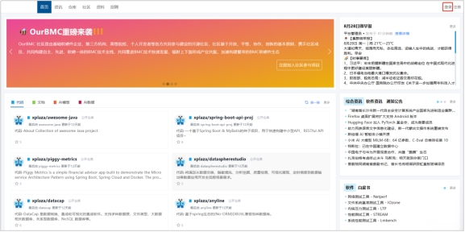 

2. 进入登录界面。

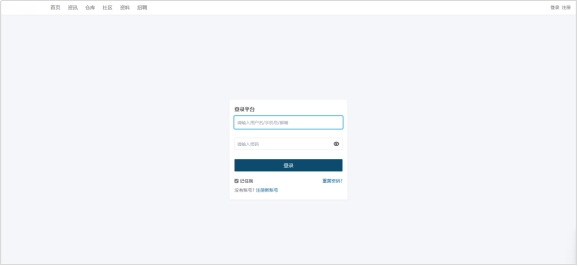 

3. 根据提示填写用户账号与密码。

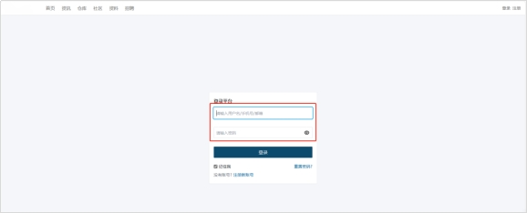 

4. 点击【登录】。

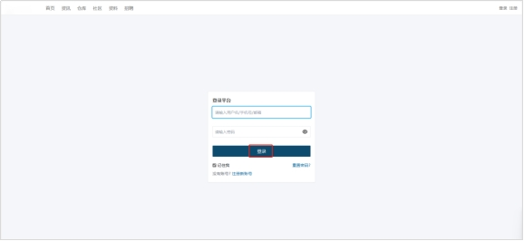 

5. 系统检验账号信息。若存在该用户信息，则成功登录。若不存在该用户信息，则登录失败。

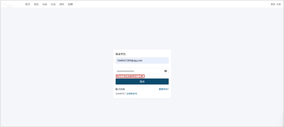

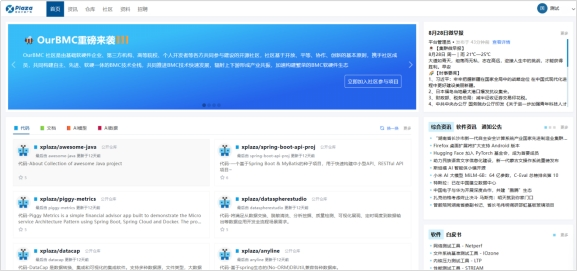 

 

## 2.1.2 用户注册功能

用户注册功能是一个允许用户创建个人账户并访问平台功能的功能。系统支持【手机号】和【邮箱】两种注册方式，下面介绍该功能具体流程。

 

**手机号注册流程**

1. 用户进入系统首页，点击右上角【注册】。

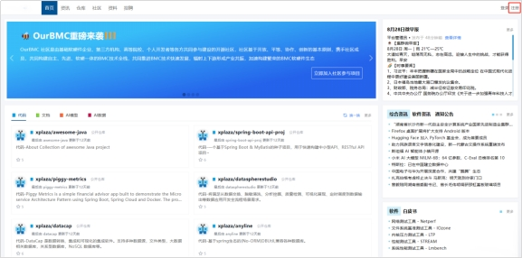 

2. 进入手机号注册界面。

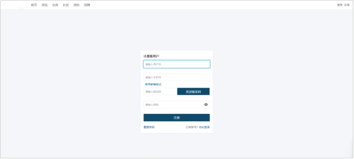 

3. 根据提示填写注册信息。

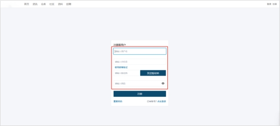 

4. 点击【发送验证码】。

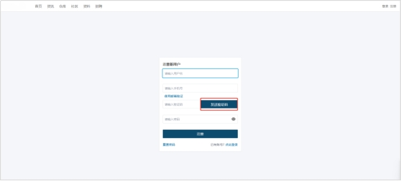 

5. 输入接收到的验证码，点击【登录】。

 

6. 系统检验注册信息。注册成功，返回系统首页。注册失败，页面提示失败原因。

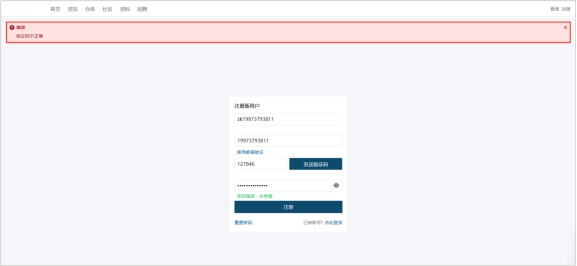 

 

**邮箱注册流程**

1. 进入注册页面，点击【使用邮箱注册】。

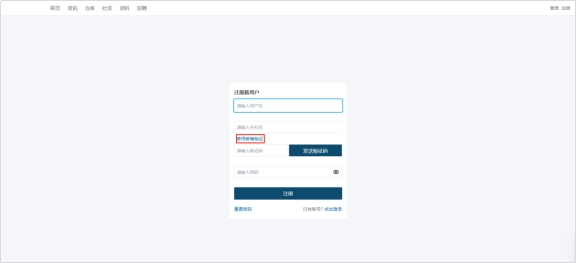 

2. 输入注册信息，点击【注册】。

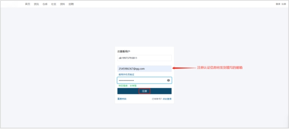 

3. 若邮箱不存在或与已被注册，提示错误信息。

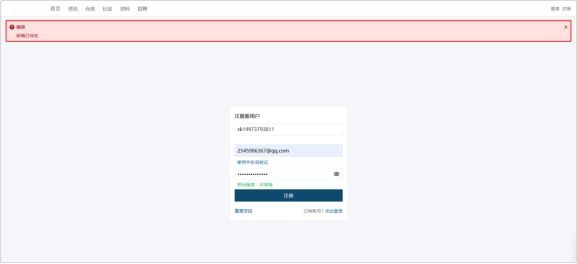 

4. 点击【邮箱链接】，注册成功。

 

## **2.1.3** **重置密码功能**

重置密码功能是一个允许用户通过提供验证信息来重新设置其密码的功能。下面介绍该功能具体流程。

 

**重置密码功能流程**

1. 用户进入登录界面，点击【重置密码】。

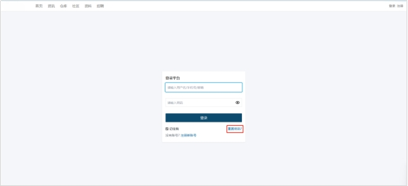 

2. 填写表单信息。

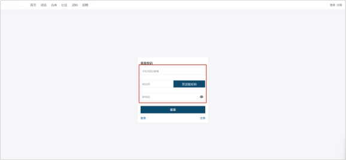 

3. 点击【发送验证码】。

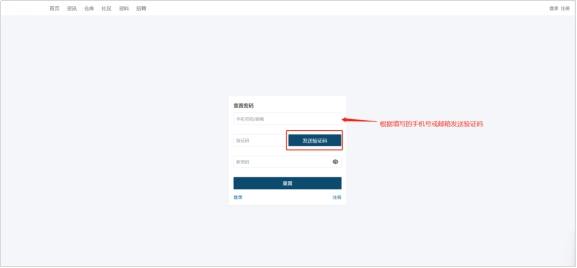 

4. 系统检测用户账号是否存在，若存在，则根据填写手机号或邮箱发送验证。若不存在，则提示用户信息不存在。**刚注册的账号只能根据注册的手机号或邮箱接收验证码，可通过绑定邮箱或手机号来接收。**

 

5. 点击【重置】。页面跳转，密码重置成功。

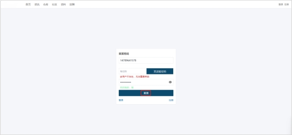 
