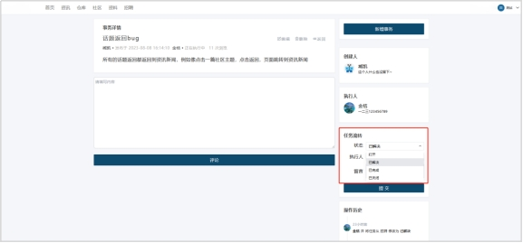

# **2.6 公司事务**

## **2.6.1 新增bug功能**

新增Bug功能是一个用于在软件开发过程中记录和跟踪Bug的功能。该功能可以帮助开发团队及时发现和解决问题，提高软件质量和用户体验。下面描述该功能操作流程。

 

**新增bug流程**

【登录】系统后，点击【个人下拉框】，点击【公司事务】。

1. 点击【新增事务】。

 

2. 根据页面内容，填写事务【标题】、【类型】、【优先级】、【执行人】、【状态】。

 

3. 系统提供【插入图片】、【上传附件】和【预览】功能。

 

4. 点击【插入图片】图标，选择插入【公司相册】或【个人相册】中的图片。

 

5. 点击【上传附件】图标，选择【上传】原件。

 

6. 点击【提交】。

 

 

 

 

 

 

 

 

## **2.6.2 表单校验**

表单检验功能是一个用于检测和验证用户输入数据是否符合要求的功能。该功能可以帮助平台管理员或开发人员确保用户输入的数据格式正确、完整和安全，从而提高数据质量和系统安全性。下面描述该功能操作流程。

 

**表单校验流程**

系统对表单必选项检测，看是否漏填或错填。

 

 

 

 

 

 

 

 

 

 

 

 

## **2.6.3 bug搜索**

Bug搜索功能是一个用于在软件开发过程中查找和筛选Bug的功能。该功能可以帮助开发团队快速定位和解决问题，提高软件质量和开发效率。下面描述该功能操作流程。

 

**bug搜索功能流程**

1. 用户点击点击【个人下拉框】，点击【公司事务】，进入事务界面。

 

2. 在搜索框中选择事务筛选条件或输入事务名称。

 

3. 点击【搜索】，系统根据搜索条件搜索对应事务。

 

4. 点击【清除】，清空搜索条件。

 

 

 

 

 

 

 

 

 

 

## **2.6.4 评论沟通**

为方便公司人员之间沟通bug解决办法，提高bug解决效率，系统提供评论沟通功能，下面描述该功能操作流程。

 

**评论沟通流程**

1. 用户点击点击【个人下拉框】，点击【公司事务】，进入事务界面。

 

2. 点击需要评论的事务，进入事务界面。

 

 

3. 填写内容，点击【提交】。

 

 

 

 

 

 

 

 

 

## **2.6.5 负责人转变**

负责人转变功能是一种允许用户将任务或项目的负责人从一个人更改为另一个人的功能。通过这个功能，用户可以将任务或项目的控制权交给新的负责人，从而确保任务或项目能够继续顺利进行。下面描述该功能操作流程。

 

**负责人转变流程**

1. 进入事务界面，点击需要的事务。

 

2. 在任务流转，选择事务状态与执行人。

 

3. 点击提交，页面跳转，事务状态、负责人转变。

 

 

 

 

 

## **2.6.6 个人管理界面**

个人管理界面是一个将用户正在处理或已归档的Bug整理展示功能，下面描述该功能操作流程。

 

**个人管理页面功能展示**

1. 分为【我的事务】（即正在处理的bug）和【我的归档】（已经处理的事务）。

 

 

2. 可通过条件搜索事务或分类搜索事务。

 

 

## **2.6.7 bug归档**

Bug归档功能是一种允许用户将已经解决的Bug从活动Bug列表中移除并存档的功能。当用户解决一个Bug并确认它不再需要被跟踪时，他们可以使用归档功能将其移动到存档列表中。下面描述该功能操作流程。

 

**bug归档流程**

1. 用户进入事务界面，点击目标【事务】。

 

2. 处理bug，修改【bug状态】。

 

3. 点击【全部归档】，按条件搜索已归档事务。

 

4. 点击【搜索】，页面显示目标事务。

 

5. 点击【清除】，清空搜索条件。

 
