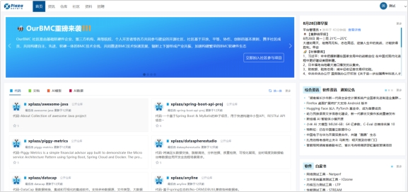
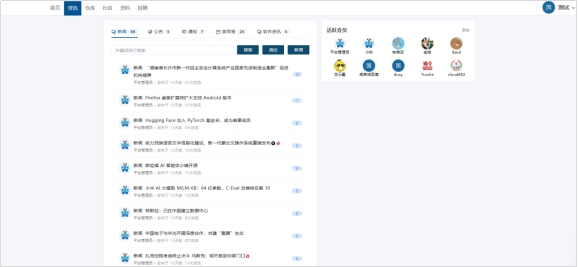
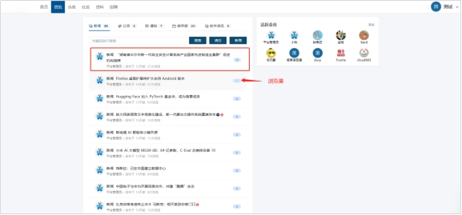
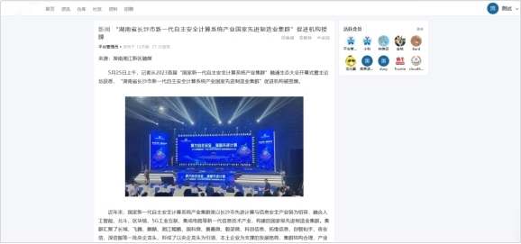
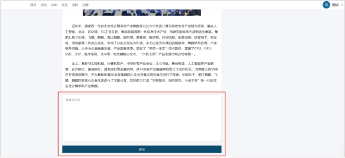
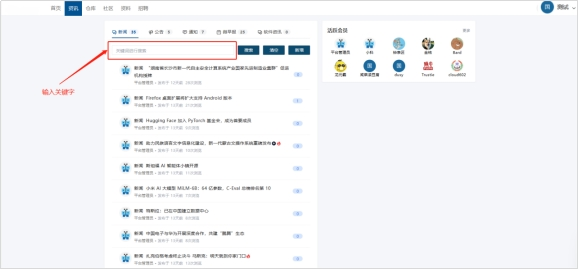
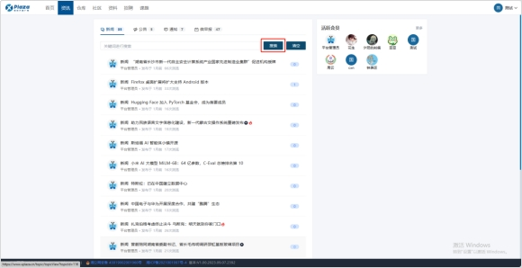
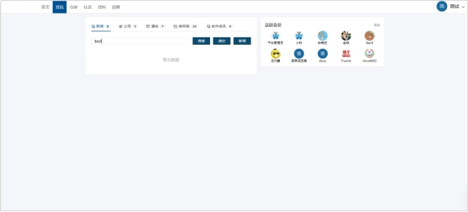

# **2.2 资讯浏览模块**

## **2.2.1新闻浏览功能**

新闻浏览功能是一个允许用户浏览、搜索新闻文章的功能。用户可以使用该功能来查看新闻文章的内容、布局和发布时间等方面。下面描述该功能操作流程。

 

**新闻浏览流程**

1. 用户【登录】后进入首页，点击【咨询下拉框】，点击【新闻】。

 

2. 页面跳转到新闻界面。

 

3. 点击任意新闻，页面跳转新闻内容界面，查看新闻内容。

 

 

4. 系统提供评论功能，用户可在评论框填写评论，点击【评论】，后台通过审核后展示评论内容。

 

 

## **2.2.2新闻搜索功能**

新闻搜索功能是一个允许用户在平台上搜索新闻文章的功能。用户可以使用关键词或短语来查找他们感兴趣的新闻文章，并根据不同的筛选条件来缩小搜索范围。下面描述该功能操作流程。

 

**新闻搜索功能流程**

1. 进入新闻管理界面，在搜索框输入关键字。

 

2. 点击【搜索】。

 

3. 系统根据关键字进行匹对，若文章存在关键字，则显示该文章。若没有文章存在关键字，则显示暂无数据。

 

 

 

## **2.2.3 公告、通知浏览功能**

公告、通知浏览功能是一个允许用户搜索、浏览公告、通知的功能。用户可以使用该功能来查看公告、通知的内容、布局和发布时间等方面。操作流程与新闻管理相同。

 

## **2.2.4 微早报浏览功能**

微早报浏览功能是一个允许用户搜索、浏览微早报的功能。微早报是一种短小精悍的新闻摘要，通常包含当天或当周的重要新闻事件和资讯。用户可以使用该功能来查看微早报的内容、布局和发布时间等方面。下面介绍查看微早报流程。【微早报的发布与新闻发布类似，只能由管理员发布】。