# **2.4 个人中心模块**

## **2.4.1 个人信息修改**

个人信息修改功能是允许用户在平台上修改自己个人信息的功能。用户可以使用该功能来更新自己的用户名、头像、密码、邮箱等信息，从而保持个人信息的准确性和完整性。下面介绍该功能具体流程。

 

**个人信息修改流程**

1. 用户【登录】后，点击【用户下拉框】。

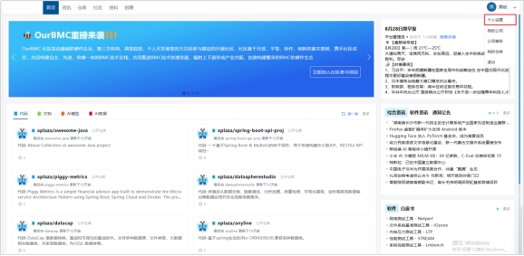 

2. 点击【个人设置】，进入个人中心页面。

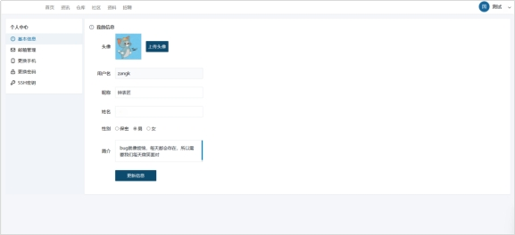 

3. 填写用户信息，点击【更改信息】。

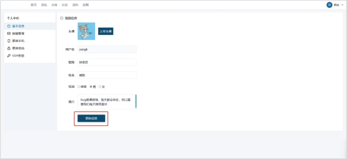 

4. 页面提示更改成功，刷新页面，信息修改成功。

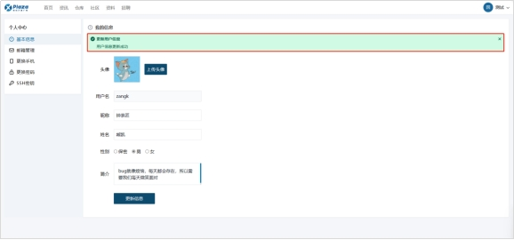 

 
 

## **2.4.2 头像上传**

头像上传功能是允许用户在平台上上传自己头像的功能。用户可以使用该功能来设置自己的头像，从而更好地展示自己的个性和特点。下面介绍该功能具体流程。

 

**头像上传流程**

1. 进入个人中心界面，点击【上传头像】。

 

2. 选择图片，点击【上传】。

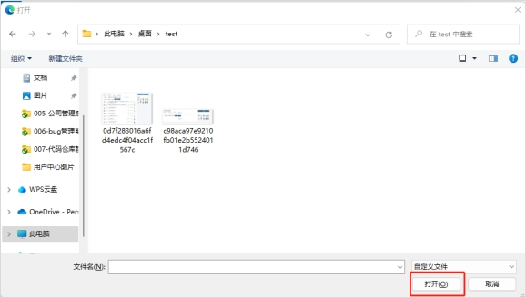 

 

## **2.4.3 密码修改功能**

密码修改功能是允许用户在平台上修改自己账户密码的功能。用户可以使用该功能来更新自己的密码，从而增强账户的安全性。下面介绍该功能具体流程。

 

**密码修改流程**

1. 进入个人中心界面，点击【更改密码】。

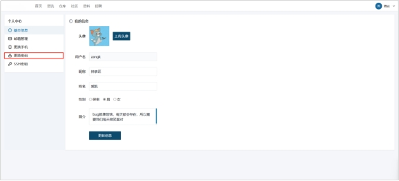 

2. 点击【发送验证码】。

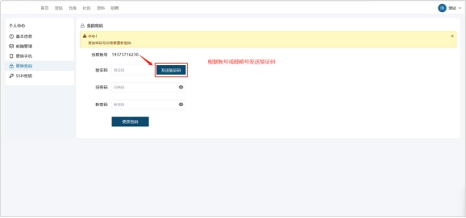 

3. 填写验证码，填写新旧密码。

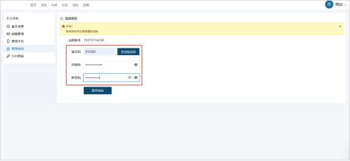 

4. 点击【更改密码】。

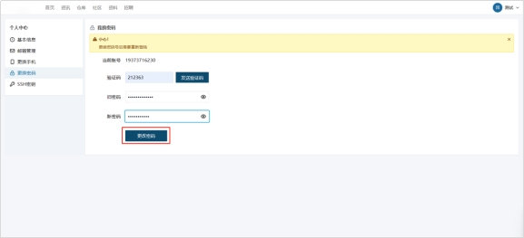 

 

## **2.4.4 邮箱绑定**

邮箱绑定功能是允许用户在平台上绑定自己邮箱的功能。用户可以使用该功能来将自己的邮箱与平台账户进行关联，从而方便接收平台的邮件通知和重要信息。下面介绍该功能具体流程。
  

**邮箱绑定流程**

用户进入个人设置页面，点击【绑定邮箱】。

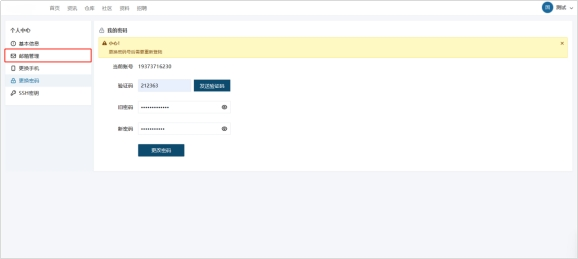 

系统检测邮箱格式，是否已被绑定，若邮箱符合格式且没有被绑定，系统向邮箱发送认证邮件。

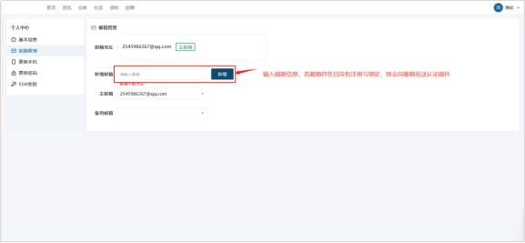 

用户点击【邮件链接】，页面跳转，提示绑定成功。

 

 

 

## **2.4.5手机更改**

手机更改功能是允许用户在平台上更改自己绑定的手机号码的功能。用户可以使用该功能来更新自己的手机号码，从而保持个人信息的准确性和完整性。下面介绍该功能具体流程。

 

**手机更改流程**

1. 用户进入跟人中心设置页面，点击【手机更改】。

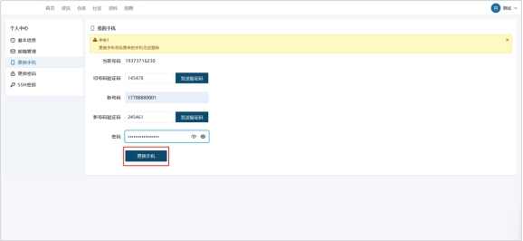 

2. 填写新旧手机号、密码信息。

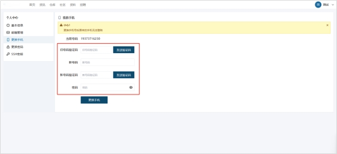 

3. 点击【发送验证码】。

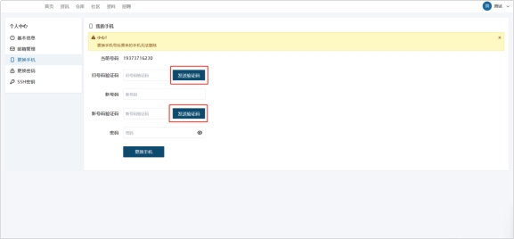 

4. 将接受的验证码填写。点击【更改手机】，刷新页面，信息修改成功。

 

 

 

## **2.4.6设置SSH密钥**

设置SSH密钥是允许用户在平台上设置自己的SSH密钥的功能。用户可以使用该功能来进行安全的身份验证，以便在远程访问服务器时进行身份验证。下面介绍该功能具体流程。

 

**设置SSH密钥流程**

1. 用户进入跟人中心设置页面，点击【SSH密钥】。

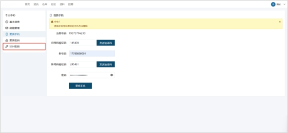 

2. 进入SSH密钥页面，点击【新增密钥】。

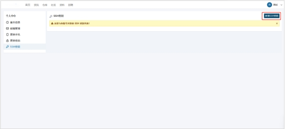 

3. 填写密钥信息，点击【提交密钥】。

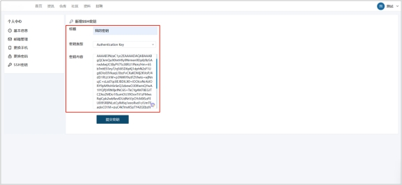 

4. 系统对密钥检测，成功页面跳转，密钥绑定成功。

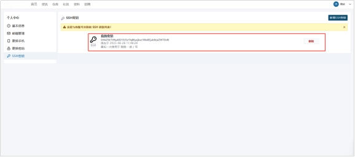 

## **2.4.7 活跃用户**

活跃用户功能是用于统计和展示平台上活跃用户的功能。该功能可以帮助平台管理员或运营人员了解平台的用户活跃度和趋势，并据此进行决策和优化。下面介绍该功能。

 

**活跃用户功能流程**

1. 平台将用户根据活跃度排列展示。

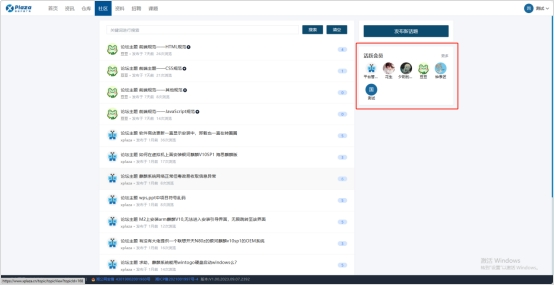 

2. 点击【更多】，可查看活跃度前100用户。

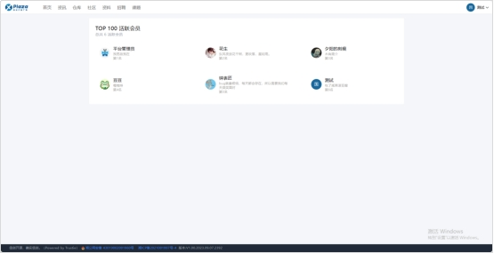 

3. 点击【用户头像】，查看该用户详细信息。

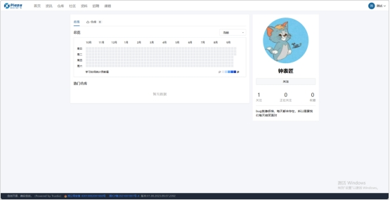 
