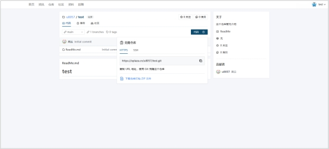
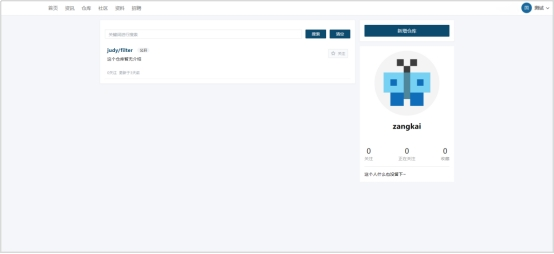

# **2.7 代码仓库**

## **2.7.1新增仓库功能**

新增仓库功能是一种允许用户在平台上创建新的代码仓库的功能。通过这个功能，用户可以轻松地创建新的代码仓库，并将其与其他用户共享。下面将以图文的形式描述该功能操作流程。

 

**新增仓库功能流程**

1. 用户【登录】后，点击【仓库】，进入仓库界面。

 

2. 点击【新增】按钮，进入新增仓库界面，若为新用户，需【绑定邮箱】。

 

 

3. 填写仓库信息，选择仓库类型。

 

4. 点击【新增仓库】。

 

5. 新增完成后，可以在仓库界面点击【仓库】查看信息。

 

 

## **2.7.2导入仓库功能**

导入仓库功能是一种允许用户将现有的代码仓库导入到平台上的功能。通过这个功能，用户可以轻松地将其现有的代码仓库迁移到平台上，并与其他用户共享。下面将以图文的形式描述该功能操作流程。

 

**导入仓库功能流程**

1. 在仓库界面点击【新增】按钮，进入新增仓库界面，点击【导入仓库】。

 

 

2. 进入导入仓库界面。

 

3. 填写【导入仓库的URL】和其他仓库信息。

 

4. 点击【新增仓库】。

 

 

## **2.7.3搜索仓库功能**

搜索仓库功能是一种允许用户在平台上搜索现有的代码仓库的功能。通过这个功能，用户可以轻松地查找他们需要的代码仓库，并与其他用户共享。下面将以图文的形式描述该功能操作流程。

 

**搜索仓库功能流程**

1. 点击【仓库】，进入仓库界面。

 

2. 输入仓库名称，点击【搜索】。

 

3. 点击【清空】，清除搜索信息。

 

 

## **2.7.4筛选仓库功能**

筛选仓库功能是一种允许用户根据特定条件筛选现有代码仓库的功能。通过这个功能，用户可以根据关键词、仓库类型、所有者等条件来查找他们需要的代码仓库，并与其他用户共享。下面将以图文的形式描述该功能操作流程。

 

**筛选仓库功能流程**

1. 在仓库管理界面，点击【仓库类型】。

 

2. 页面跳转，页面展示选择仓库类型。

 

 

## **2.7.5仓库分支功能**

仓库分支功能是一种允许用户在代码仓库中创建和管理分支的功能。通过这个功能，用户可以在主分支的基础上创建新的分支，并在这些分支上进行开发和测试，而不影响主分支的稳定性。下面将以图文的形式描述该功能操作流程。

 

**仓库分支功能流程**

1. 点击【目标仓库】。

 

2. 点击【master下拉框】，选择需要操作的分支。

 

3. 点击【branches】查看所有分支。

 

 

## **2.7.6仓库事务功能**

仓库事务功能是一种允许用户在代码仓库中报告和跟踪Bug的功能。通过这个功能，用户可以将发现的Bug提交到仓库中，并跟踪其处理过程，直到Bug得到解决。下面将以图文的形式描述该功能操作流程。

 

**仓库事务功能流程**

1. 点击【目标仓库】，点击【事务】。

 

 

2. 系统提供输入条件【搜索】事务。

 

3. 点击【新增事务】，进入新增事务界面。

 

 

4. 填写事务信息，事务执行人默认为仓库建立者，点击【提交事务】。

 

5. 页面返回，事务提交成功。

 

 

## **2.7.7仓库社区功能**

仓库社区功能是一种允许用户在代码仓库中交流和讨论的功能。通过这个功能，用户可以在仓库中发布问题、提出建议，并与其他用户进行讨论和交流。下面将以图文的形式描述该功能操作流程。

 

**仓库社区功能流程**

1. 点击【目标仓库】，点击【社区】。

 

 

2. 进入仓库社区界面。

 

3. 系统提供输入条件【搜索】主题。

 

4. 点击【新增主题】，进入新增主题界面。

 

5. 填写主题信息，点击【提交主题】。

 

6. 页面返回，主题提交成功，等待后台审核。

 

## **2.7.8仓库拷贝功能**

仓库拷贝功能是一种允许用户将现有代码仓库复制到新的位置的功能。通过这个功能，用户可以在不影响原始代码仓库的情况下创建新的代码仓库，并在新的仓库上进行开发和测试。下面将以图文的形式描述该功能操作流程。

 

**仓库拷贝功能流程**

1. 进入目标仓库界面，点击【拷贝】。

 

2. 填写信息，点击【创建拷贝】。

 
 

## **2.7.9仓库克隆功能**

仓库克隆功能是一种允许用户将现有代码仓库复制到本地计算机上的功能。通过这个功能，用户可以在本地计算机上创建新的代码仓库，并在新的仓库上进行开发和测试。下面将以图文的形式描述该功能操作流程。

 

**仓库克隆功能流程**

1. 进入目标仓库界面，点击【代码下载】图标。

 

2. 选择【https】或【ssh】两种URL之一。

 

3. 在git中通过URL拉取仓库。

 

## **2.7.10表单校验功能**

表单校验功能是一种用于验证表单输入的功能，可以确保用户输入的数据格式正确，并在必要时提供错误提示。通过这个功能，用户可以更好地保证表单数据的准确性和完整性，从而提高应用程序的质量和可靠性。下面将以图文的形式描述该功能操作流程。

 

**表单校验功能流程**

1. 用户填写信息，点击【提交】。

 

2. 若用户出现错填或漏填，页面出现提示，用户通过提示修改信息。

 

 

 

 

 

## **2.7.11 首页仓库功能**

首页仓库功能是指在代码托管平台的首页上展示用户最近访问或关注的仓库，并提供快速访问和操作的功能。通过这个功能，用户可以更好地管理和控制其代码，并使其更容易与其他用户合作开发。下面将以图文的形式描述该功能操作流程。

 

**首页仓库功能流程**

1. 用户【登录】，进入首页面。

 

2. 点击仓库【类别】，寻找目标仓库。

 

3. 点击【仓库】，进入仓库界面。

 

 

## **2.7.12 我的仓库**

系统提供【我的仓库】界面，管理和展示本用户所创建的仓库。下面将以图文的形式描述该功能操作流程。

 

**我的仓库功能流程**

1. 点击【个人下拉框】，点击【我的仓库】。

 

2. 进入我的仓库界面。

 

 

## **2.7.13 仓库基础设置功能**

仓库基础设置功能是指在代码托管平台上允许用户配置仓库基本信息的功能。通过这个功能，用户可以更好地管理和控制其代码，并使其更容易与其他用户合作开发。下面将以图文的形式描述该功能操作流程。

 

**仓库基础设置功能流程**

1. 进入我的仓库界面。

 

2. 点击目标【仓库】。

 

3. 点击【设置】。

 

4. 进入设置界面，修改仓库信息。

 

 

## **2.7.14 协助开发伙伴功能**

协助开发伙伴功能是指在代码托管平台上允许用户与其他开发者合作开发的功能。通过这个功能，用户可以在代码仓库中协作编写代码、合并分支、解决问题等，从而提高开发效率和代码质量。下面将以图文的形式描述该功能操作流程。

 

**协助开发伙伴功能流程**

1. 点击仓库【设置】，进入设置界面。

 

2. 点击【协助伙伴】。

 

3. 点击【添加】，输入已注册的【手机号】、【用户名】、【邮箱】。

 

4. 点击【搜索】，将搜索出的用户添加。

 

5. 点击【移除】，将用户移除协助。

 
